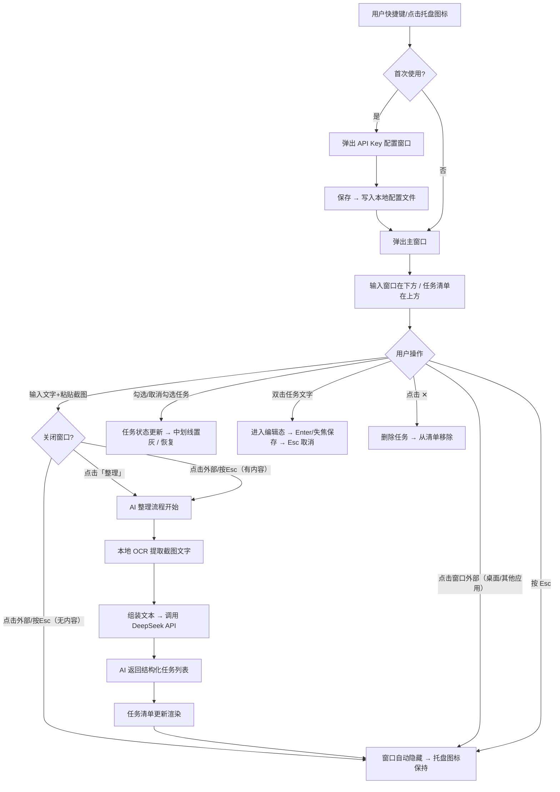

# 便利贴（Sticky Notes）PRD

> 版本：v1.0 落地版
> 日期：2026-06-13
> 状态：已确认，待开发

---

## 1. 产品概述

从概念版继承：这是一个给**事务繁忙的桌面办公者**用的 **Windows 桌面应用（Electron）**，核心链路是「随手记 → AI 整理 → 勾选执行」。系统托盘常驻，全局快捷键即呼即走，截图直接粘贴，AI 将杂乱念头变成结构化任务清单。

**产品形态**：Electron 打包 `.exe` 安装包，双击安装，开机自启，系统托盘常驻。

---

## 2. 目标用户与使用场景

### 用户画像

- **办公者**，工作上微信/钉钉/飞书不断收到任务，脑中随时冒出想法
- 每天经手 5-20 件零散杂事，不记下来就会忘
- 试过微信文件传输、桌面记事本、Excel 等方式，但都因维护成本高而放弃
- 需要"无脑记 + 自动整理 + 做完就划掉"的极简体验

### 典型使用场景

| 场景 | 描述 |
|------|------|
| **场景一：微信收到需求，随手记** | 同事在微信里发了一段话要求"周三前把合同出了"，用户截图聊天记录→全局快捷键呼出便利贴→粘贴截图→输入"下午搞"→AI 整理为"周三前出合同"任务 |
| **场景二：脑中冒出想法** | 用户正在写文档，突然想到"下班前记得找运维要服务器账号"→快捷键呼出→打字输入→AI 自动识别这是单一任务，直接加入清单 |
| **场景三：碎碎念式倾倒** | 用户一口气输入 5 件不相干的事："合同还没改完，快递要取，下午 3 点开会，记得给客户回电话，周报还没写"→AI 拆成 5 条独立任务 |

---

## 3. 核心用户动线



---

## 4. 功能清单

```
便利贴 v1.0
├── 🔴 系统托盘常驻（核心，MVP 必须有）
│   ├── 托盘图标显示（通知区域）
│   ├── 右键菜单（打开/退出）
│   ├── 点击托盘图标 → 呼出/隐藏主窗口
│   └── 开机自启
├── 🔴 全局快捷键（核心，MVP 必须有）
│   ├── 默认快捷键 Alt+` 呼出/隐藏主窗口
│   └── 快捷键可自定义
├── 🔴 输入捕获（核心，MVP 必须有）
│   ├── 文字输入（纯文本，无需富文本）
│   ├── 图片粘贴（Ctrl+V 粘贴剪贴板图片）
│   └── 整理按钮（触发 AI 分析）
├── 🔴 AI 整理（核心，MVP 必须有）
│   ├── 本地 OCR 识别截图文字
│   ├── 调用 DeepSeek API 结构化整理
│   └── 生成任务条目渲染到清单
├── 🔴 任务清单（核心，MVP 必须有）
│   ├── 勾选框 + 任务文字
│   ├── 勾选 → 中划线 + 置灰
│   ├── 再次点击 → 恢复未完成状态（防误勾）
│   ├── 今日已勾选的当日可见，次日隐藏
│   ├── 今日未勾选的次日继续显示
│   ├── 手动编辑任务文字（双击进入编辑态）
│   └── 手动删除任务（右键菜单或 ✕ 按钮）
├── 🟡 API Key 配置（重要，MVP 必须有）
│   ├── 首次启动弹出配置窗口
│   ├── 存储到本地加密文件
│   └── 托盘右键菜单可重新配置
├── 🟡 数据本地存储（重要，MVP 必须有）
│   ├── 任务数据 JSON 文件存储
│   ├── 历史数据按日期分文件（可手动翻阅）
│   └── 数据永不自动删除
└── 🟡 安装包（重要，MVP 必须有）
    ├── NSIS 打包 .exe 安装包
    └── 双击安装，创建桌面快捷方式
```

---

## 4.1 关键页面布局线框图

### 主窗口（系统托盘弹出）

```
┌─────────────────────────────┐
│                             │
│   ☐ 周三前出合同        ✕   │  ← 任务清单区（上部方形区域）
│   ☐ 找运维要服务器账号    ✕  │     勾选→中划线置灰
│   ☐ 下午3点开会         ✕   │     双击编辑文字
│   ☐ 给客户回电话         ✕   │     ✕ 删除任务
│   ☐ 写周报   ☑ 已完成项目 ✕  │     已勾选置灰且等待次日隐藏
│                             │     垂直滚动
├─────────────────────────────┤
│  ┌─ 截图缩略图 ─────────┐   │  ← 输入区（下部方形区域）
│  │  [聊天截图预览]      ✕ │   │     文字 + 图片粘贴
│  │                      │   │     点击「整理」触发 AI
│  └──────────────────────┘   │
│                             │
│  下午把合同出了，还有...      │  ← 纯文本输入框（无格式）
│                             │
│              [ 整理 ▸ ]     │  ← 手动触发 AI（关闭窗口时也会自动整理）
└─────────────────────────────┘
```

- **窗口定位**：固定右下角，贴任务栏上方，不可拖动
- **关闭行为**：点击窗口外部/按 Esc → 若有内容则自动 AI 整理后再隐藏；若为空则直接隐藏。再次快捷键/点击图标重新呼出。
- **整理按钮**：保留，用于用户想停留在窗口中即时看到整理结果时手动触发。关闭窗口时会自动触发，无需非得点按钮。
- **窗口尺寸**：约 360×480px，固定宽度，清单区可随条目变多垂直滚动

### API Key 配置窗口（首次启动）

```
┌─────────────────────────────────┐
│        便利贴 - 初始配置          │
│                                 │
│   需要配置 AI 服务才能使用        │
│                                 │
│   API Key                      │
│   ┌─────────────────────────┐  │
│   │ sk-xxxxxxxxxxxxxxxxxxxx │  │
│   └─────────────────────────┘  │
│                                 │
│   API 地址（可选，默认 DeepSeek）│
│   ┌─────────────────────────┐  │
│   │ https://api.deepseek.com│  │
│   └─────────────────────────┘  │
│                                 │
│              [ 保存并启动 ]      │
└─────────────────────────────────┘
```

---

## 5. 功能详细描述

### 5.1 系统托盘常驻

**功能描述**：应用启动后以系统托盘图标形式常驻在 Windows 通知区域（输入法旁边），不占据任务栏空间。核心交互为点击图标呼出/隐藏主窗口，右键提供菜单选项。

**触发条件**：应用启动（开机自启或手动启动）。

**交互细节**：

| 场景 | 交互处理方式 |
|------|------------|
| 点击托盘图标 | 直接呼出主窗口（右下角弹出），再次点击则隐藏 |
| 点击窗口外部/按 Esc | 窗口隐藏。若输入区有内容 → 自动触发 AI 整理后再关闭；若输入区为空 → 直接关闭 |
| 右键托盘图标 | 弹出右键菜单：「打开」「配置 API Key」「开机自启 ✓」「退出」 |
| 首次启动 | 托盘图标显示，同时弹出 API Key 配置窗口（见 5.6） |
| 双击托盘图标 | 等同于单击，呼出/隐藏 |

**状态清单**：

| 状态 | 触发条件 | UI 表现 | 用户可执行操作 |
|------|---------|---------|-------------|
| 常驻 | 应用运行中 | 托盘图标显示 | 单击呼出/隐藏，右键菜单 |
| 退出 | 点击「退出」 | 图标消失，进程结束 | - |

**边界条件**：

- 应用崩溃/被强制结束后：托盘图标消失，数据不丢失（已写入本地文件）
- 系统关机：应用随系统正常退出

---

### 5.2 全局快捷键

**功能描述**：用户可设置全局快捷键，在任何应用前方呼出/隐藏便利贴主窗口，无需鼠标点击图标。

**触发条件**：应用运行期间，按下设定的快捷键组合。

**交互细节**：

| 场景 | 交互处理方式 |
|------|------------|
| 按下快捷键 | 窗口在右下角弹出，输入框自动获得焦点 |
| 再次按下 | 窗口隐藏（不关闭，内容保留） |
| 快捷键冲突 | 提示用户更换快捷键 |

**默认快捷键**：`Alt + \``（用户可在配置文件修改）

**边界条件**：

- 快捷键被其他应用占用时：提示冲突，引导更换
- 用户在全屏应用（游戏/演示）中：快捷键仍生效，窗口弹出

---

### 5.3 输入捕获

**功能描述**：窗口下半部分为输入区。用户可直接输入文字，或粘贴剪贴板中的图片（聊天截图为主）。输入内容无序无格式要求，支持"碎碎念"式倾倒。

**触发条件**：主窗口打开后，输入区处于可用状态。

**交互细节**：

| 场景 | 交互处理方式 |
|------|------------|
| 输入文字 | 纯文本输入，无富文本工具栏，不打断思路 |
| 粘贴图片 | `Ctrl+V` 粘贴剪贴板中的图片，显示缩略图预览 |
| 粘贴多张图片 | 依次排列显示缩略图，每张可独立删除（点 ✕） |
| 删除图片 | 点击缩略图右上角 ✕ 按钮 |
| 点击「整理」按钮 | 触发 AI 链路（见 5.4），按钮显示 loading 状态 |
| 关闭窗口（外部/快捷键/Esc）且输入区有内容 | 自动触发 AI 整理（等同于点击「整理」），无需手动按钮 |
| 关闭窗口（外部/快捷键/Esc）且输入区为空 | 直接关闭，无操作 |
| 未输入内容点「整理」 | 按钮置灰不可点击 |

**状态清单**：

| 状态 | 触发条件 | UI 表现 | 用户可执行操作 |
|------|---------|---------|-------------|
| 空 | 窗口打开/已整理完 | 输入框为空，无缩略图 | 输入/粘贴 |
| 有内容 | 用户输入/粘贴后 | 文字+缩略图显示，「整理」按钮可点击 | 继续输入/删图/点整理 |
| 整理中 | 点击「整理」后 | 按钮转圈+"整理中..."，输入区不可编辑 | 等待或关闭窗口 |
| 整理完成 | AI 返回结果 | 输入区清空，任务清单更新 | 继续输入新内容 |

**边界条件**：

- 内容为空时：整理按钮禁用
- 图片超大时（>20MB）：显示"图片过大，请压缩后重试"
- 粘贴非图片内容（文件等）：不支持，无反应
- 输入纯空格/换行：视为空内容

---

### 5.4 AI 整理（OCR + DeepSeek）

**功能描述**：用户点击「整理」后，系统先对输入区中的图片执行本地 OCR 提取文字，再将"输入文字 + OCR 结果"组装为 prompt 发送给 DeepSeek，由 AI 将杂乱内容整理为结构化任务列表。

**触发条件**：用户点击「整理」按钮。

**处理流程**：

```
文字输入 + 图片
    ↓
图片 → Tesseract.js 本地 OCR → 提取中文文字
    ↓
组装 prompt：用户输入 + OCR 结果
    ↓
调用 DeepSeek API（chat/completions）
    ↓
解析返回 JSON → 任务条目数组
    ↓
追加到任务清单
```

**OCR 技术方案**：

| 项目 | 选择 |
|------|------|
| 引擎 | Tesseract.js（Apache-2.0，纯 JS，无需本地安装） |
| 语言包 | `chi_sim`（简体中文识别） |
| 预处理 | 截图原图直传，不做缩放 |
| 降级机制 | OCR 失败时，将图片以 base64 描述告知 AI "用户提供了一张截图但未能识别" |

**AI Prompt 设计要点**：

- 要求 AI 从碎碎念中提取独立任务，每项用简洁的一句话表述
- 返回严格 JSON 数组格式：`[{"task": "任务内容"}, ...]`
- 不要给任务添加额外编号、优先级、分类——保持输出纯净
- 如果用户输入本身已是单一明确任务，就返回单条

**交互细节**：

| 场景 | 交互处理方式 |
|------|------------|
| 整理成功 | 任务追加到清单顶部，输入区清空，完成提示一闪而过 |
| OCR 失败（图片无文字/模糊） | 仍调用 AI，prompt 中注明"图片 OCR 失败，请根据文字描述推测" |
| AI API 调用失败 | 输入区内容保留不清空，提示"AI 服务异常，请稍后重试"，保留重试按钮 |
| API Key 未配置 | 弹出配置窗口（见 5.6），整理操作中断 |
| AI 返回格式异常 | 尝试容错解析，失败则提示"AI 返回格式异常，请重试" |

**状态清单**：

| 状态 | 触发条件 | UI 表现 | 用户可执行操作 |
|------|---------|---------|-------------|
| 就绪 | 输入区有内容 | 整理按钮可点击 | 点击整理 |
| OCR 中 | 有图片时 | 按钮文字"识别图片中..." | 等待 |
| AI 调用中 | OCR 完成 | 按钮文字"AI 整理中..."，转圈 | 等待 |
| 成功 | 返回结果 | 任务清单更新，输入区清空 | 继续使用 |
| 失败 | 超时/报错 | 红色提示 + 内容保留 | 重试/关闭窗口 |

**边界条件**：

- 网络异常或请求超时时：30 秒超时，提示重试
- API Key 余额不足时：DeepSeek 会返回 402 错误，前端提示"API 余额不足"
- 用户快速连续点击「整理」：按钮在整理中 disabled，防止重复提交
- 图片数量上限：单次最多粘贴 5 张截图

---

### 5.5 任务清单

**功能描述**：窗口上半部分展示由 AI 整理后的任务清单。每条任务有一个勾选框 + 任务文字。勾选后文字添加中划线并置灰；再次点击勾选框恢复原状。今日已勾选的任务次日自动隐藏（数据不删），今日未勾选的任务次日继续显示。支持手动编辑任务文字和删除任务。

**触发条件**：主窗口打开时始终显示。

**交互细节**：

| 场景 | 交互处理方式 |
|------|------------|
| 勾选任务 | 文字立即添加中划线 + 置灰，勾选框变实心 |
| 再次点击（误勾恢复） | 文字恢复原状，勾选框变空心 |
| 双击任务文字 | 进入编辑态，文字变为输入框，聚焦并全选，回车确认、失焦自动保存 |
| 删除任务 | 每条任务右侧有 ✕ 按钮，点击删除（无二次确认、即时生效） |
| 空清单 | 显示引导文案"还没有任务，在下方输入后点击「整理」吧"（见文案规范） |
| 任务过多 | 清单区垂直滚动，最新添加的任务在顶部 |

**手动编辑详细行为**：

| 属性 | 说明 |
|------|------|
| 触发 | 双击任务文字 |
| 编辑态 UI | 文字替换为 input 输入框，自动聚焦并全选文字 |
| 确认 | 按 Enter 或失焦（点击别处）保存 |
| 取消 | 按 Escape 放弃修改，恢复原文字 |
| 保存位置 | 直接更新本地 JSON 文件 |
| 空文字处理 | 内容为空时不做保存，恢复原文字 |

**手动删除详细行为**：

| 属性 | 说明 |
|------|------|
| 触发 | 点击任务右侧 ✕ 按钮（或右键菜单「删除」） |
| 确认 | 无二次确认弹窗，即时删除 |
| 数据 | 从本地 JSON 文件中移除该条目 |
| 误删恢复 | 不做回收站，数据不可恢复（简单工具定位） |

**任务条目生命周期**：

```
用户输入 → AI 整理 → 任务创建（今日，未勾选）
    ↓
用户勾选 → 已勾选状态（中划线置灰，今日可见）
    ↓
次日 00:00 → 已勾选任务从清单中隐藏（数据保留在本地文件）
    ↓
未勾选任务 → 次日继续显示在清单中
```

**数据存储结构**：

```json
[
  {
    "id": "uuid",
    "task": "周三前出合同",
    "completed": false,
    "createdAt": "2026-06-13T14:30:00+08:00",
    "completedAt": null
  }
]
```

- 存储路径：`%APPDATA%/sticky-notes/tasks/YYYY-MM-DD.json`
- 按日期分文件，方便手动翻阅
- 数据永不自动删除

**状态清单**：

| 状态 | 触发条件 | UI 表现 | 用户可执行操作 |
|------|---------|---------|-------------|
| 未勾选（默认） | 任务创建 | 空心圈 + 正常文字 | 点击勾选 |
| 已勾选 | 用户勾选 | 实心圈 + 中划线 + 灰色文字 | 再次点击恢复 |
| 已隐藏 | 已勾选 + 跨天 | 不在清单中显示 | 手动翻阅历史文件可查看 |

**边界条件**：

- 任务文字超长（>200 字）时：文字省略号截断 + tooltip 显示全文，编辑态时 input 无字数限制
- 清单条数为 0 时：显示空状态引导
- 用户连续快速勾选/取消：每次点击独立处理，无防抖
- 任务数量超过 50 条时：清单区内部滚动，不撑开窗口
- 编辑后为空文字：放弃修改，恢复原文字
- 删除误操作：不做回收站机制，简洁优先

---

### 5.6 API Key 配置

**功能描述**：首次启动时弹出配置窗口，用户填入自己的 DeepSeek API Key。配置存储在本地加密文件中，后续启动不再弹出。用户可通过托盘右键菜单重新配置。

**触发条件**：首次启动自动弹出；或用户通过托盘右键菜单「配置 API Key」手动触发。

**交互细节**：

| 场景 | 交互处理方式 |
|------|------------|
| 首次启动 | 主窗口不弹出，先弹出配置窗口 |
| 保存成功 | 提示"配置已保存"，关闭配置窗口，弹出主窗口 |
| API 地址留空 | 使用默认值 `https://api.deepseek.com` |
| 重新配置 | 输入框预填当前已保存的值 |

**存储方式**：写入本地加密文件，Electron `safeStorage` API 加密。存储路径 `%APPDATA%/sticky-notes/config.enc`。

**状态清单**：

| 状态 | 触发条件 | UI 表现 | 用户可执行操作 |
|------|---------|---------|-------------|
| 未配置 | 首次启动 | 配置窗口弹出 | 填写并保存 |
| 已配置 | 保存过 | 正常使用 | 托盘菜单可重新配置 |
| 配置错误 | API 调用失败（401） | 提示"API Key 无效" | 重新配置 |

**边界条件**：

- API Key 格式校验：至少填写内容，不做长度上限
- 保存时写入失败（磁盘满/无权限）：提示"保存失败，请检查磁盘空间或权限"
- 配置文件被手动删除：视为首次启动，弹出配置窗口

---

### 5.7 安装包

**功能描述**：将 Electron 应用打包为 `.exe` 安装包，用户双击安装，全程无需技术操作。

**方案选择**：Electron Builder + NSIS，生成标准 Windows 安装程序。

**安装流程**：双击 `.exe` → 选择安装路径 → 安装完成 → 创建桌面快捷方式 → 自动启动应用。

**安装包内容**：

| 项目 | 说明 |
|------|------|
| 打包工具 | electron-builder |
| 安装格式 | NSIS（.exe） |
| 体积预估 | ~100MB（含 Electron Runtime + Tesseract 语言包） |
| 开机自启 | 安装后默认开启，用户可在托盘菜单关闭 |
| 自动更新 | v1 不做，后续迭代考虑 |

---

## 6. 文案规范

### 6.1 产品整体文案风格定义

**风格：简洁直接**（适合效率工具类产品）。不抖机灵，不废话，让用户一秒看懂就能操作。

### 6.2 面向终端用户的产品文案

| 场景 | 文案内容 | 风格备注 |
|------|---------|---------|
| 窗口标题 | 便利贴 | 简短 |
| 输入框占位符 | 记录想做的事... | 引导但不唠叨 |
| 整理按钮 | 整理 ▸ | 动词开头 |
| 整理中按钮 | 识别图片中... / AI 整理中... | 让用户知道在工作 |
| 空状态标题 | 还没有任务 | 陈述事实，不带情绪 |
| 空状态说明 | 在下方输入想做的事，然后点击「整理」 | 直接告诉用户怎么做 |
| 空状态按钮 | 不需要按钮，引导已在上方文字中 | |
| 勾选成功 | 无 toast，直接视觉反馈 | 静默操作 |
| 整理成功 | 无 toast，任务清单直接更新 | 静默操作 |
| AI 调用失败 | AI 服务异常，请稍后重试 | 原因 + 操作 |
| API Key 无效 | API Key 无效，请重新配置 | 原因 + 操作 |
| API 余额不足 | API 余额不足，请充值后重试 | 原因 + 操作 |
| 图片过大 | 图片过大，单张不超过 20MB | 原因 + 操作 |
| 托盘「打开」 | 打开便利贴 | 动词开头 |
| 托盘「配置」 | 配置 API Key | 动词 + 对象 |
| 托盘「开机自启」 | 开机自启 ✓ | 状态可见 |
| 托盘「退出」 | 退出便利贴 | 明确对象 |
| 配置窗口标题 | 便利贴 - 初始配置 | 场景明确 |
| 配置保存按钮 | 保存并启动 | 动词 + 结果 |

---

## 7. 非功能性需求

- **性能要求**：主窗口弹出 < 300ms，OCR 识别 < 3s/张，AI 调用 < 15s（含网络），应用内存占用 < 150MB
- **权限控制**：无需登录，仅本地使用
- **兼容性**：Windows 10/11，64 位系统
- **数据安全**：API Key 使用 Electron `safeStorage` 加密存储；任务数据为本地明文 JSON，不做额外加密
- **数据存储**：任务数据按日分文件存储在 `%APPDATA%/sticky-notes/tasks/`，永不自动删除；配置存储在 `%APPDATA%/sticky-notes/config.enc`

---

## 8. 待确认问题

- [x] 快捷键默认用 `Alt + \``
- [x] 需要支持手动编辑任务文字（双击进入编辑态）和删除任务（✕ 按钮）
- [x] 窗口固定在右下角任务栏上方，不可拖动
